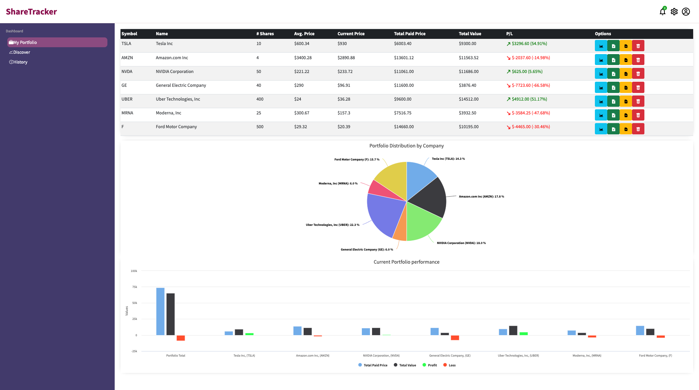
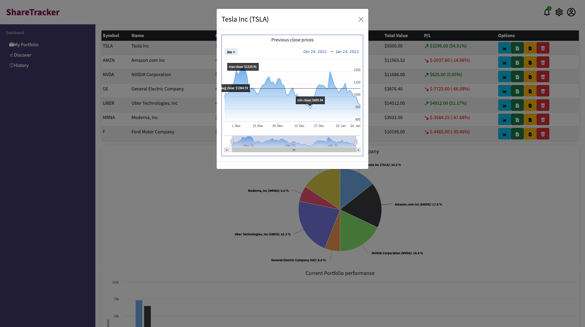
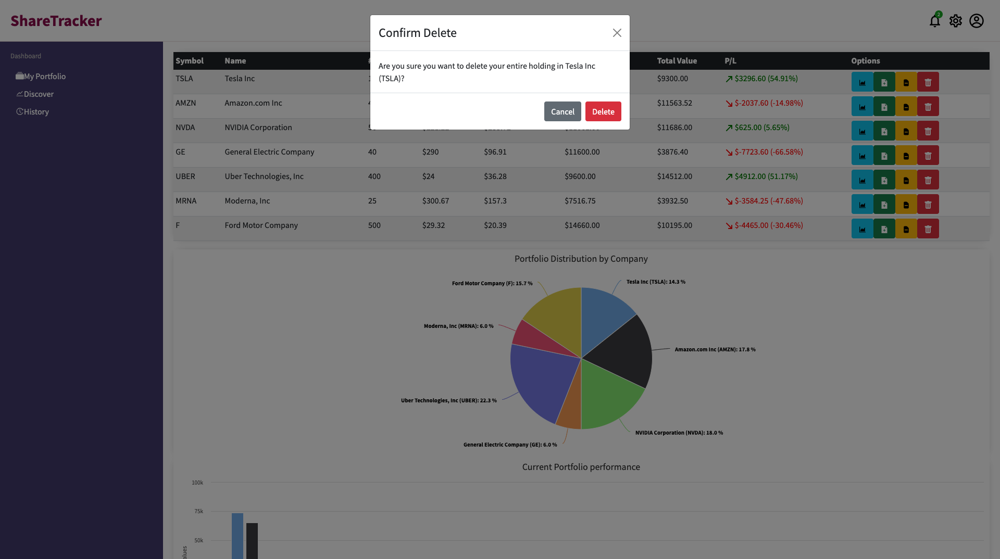

# Portfolio Tracker
The Portfolio Tracker application empowers users to monitor the performance of their stock holdings and the overall portfolio value in real-time. The "Discover" section enables users to select from a range of stocks sourced from an external API, with real-time data provided by the NASDAQ stock exchange. Users have the capability to compare various stocks, incorporate them into their portfolio, and track the real-time fluctuations of their total portfolio value, which is dynamically displayed on the "My Portfolio" page.

This application is developed using the MERN stack, comprising MongoDB, Express.js, React, and Node.js.


## Screenshots


Portfolio / Home Page









Discover Page


## Project brief
A local trader approached us with the need for a better way to analyze her stock portfolio. This project focuses on creating an MVP that addresses this need. We will leverage a provided sample dataset to build a tool that effectively displays portfolio information, enabling the trader to make more informed investment decisions.

## MVP

A user should be able to:

- Add/Remove/Update/Delete Shares.
- View total current value.
- View individual and total performance trends.
- Retrieve a list of share prices from an external API and add shares to their portfolio.
- View a chart of the current values in their portfolio.

## Extensions

- View current share price of individual shareholdings.
- View average and total paid prices for individual shares in the portfolio.
- View a chart of total paid price, total value and profit/loss.
- Implement a search box to find a specific stock using external API data.
- Temporarily add searched and selected stock to compare.
- Compare past share performance data for any publicly traded company.

## API, Libraries, Resources
- https://financialmodelingprep.com/ (Requires an account)
- https://www.highcharts.com/ HighCharts is an open-source library for rendering responsive charts.
- https://reactjs.org/
- https://expressjs.com/
- https://www.mongodb.com/
- https://nodejs.org/en/

## The project is built using:
* Javascript (Node)
* React
* Express
* MongoDB
* HTML / CSS
* Additional libraries used: HighCharts, Bootstrap
The application is using Financial Modeling Prep API as a source of stock data: https://financialmodelingprep.com/developer/docs/

## Project set up

| Front-end (client) | Back-end (server)    |
| :---               | :---                 |
| `npm install`      | `npm install`        |
| `npm start`        | `npm run seeds`      |
|                    | `npm run server:dev` |

To run this application locally, sign-up to get a free API key kere: https://financialmodelingprep.com/. Then inside ``` client/src/services ``` folder create a new file ```apikey.js```. Inside this file insert the line from bellow adding your API key where indicated:

```

export const apikey = "API_key_here"
export const apikeyPH = "API_key_here"

```